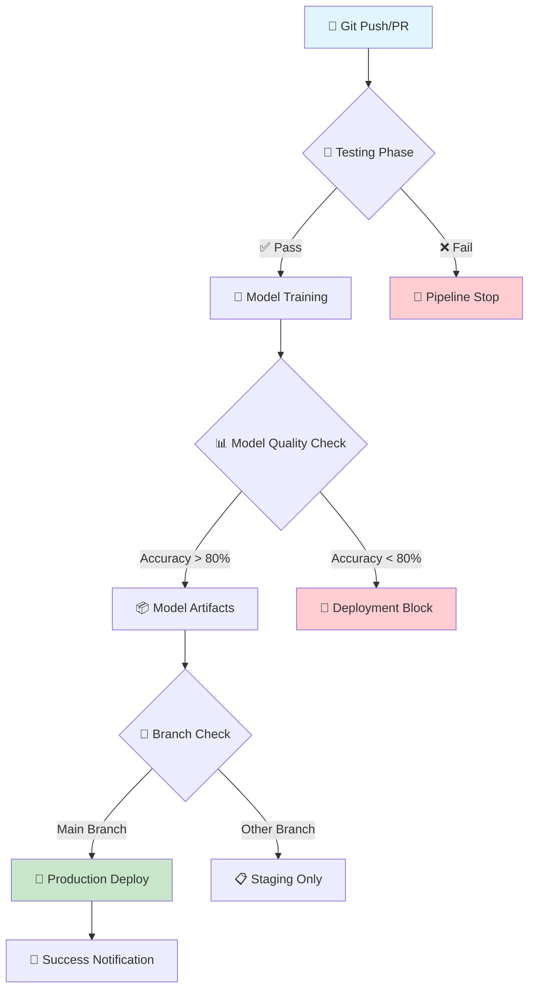

<div align="center">

# 🚀 ML CI/CD Pipeline with GitHub Actions


**Implementasi Continuous Integration & Continuous Deployment untuk Machine Learning**

---

### 👨‍💻 **Informasi Mahasiswa**
**Nama:** Hafiyan Al Muqaffi Umary  
**NIM:** 225150207111117  
**Mata Kuliah:** ML Ops  
**Tugas:** GitHub Actions CI/CD untuk Machine Learning  

---

</div>

## 📋 **Daftar Isi**

- [🎯 Overview](#-overview)
- [🏗️ Arsitektur Pipeline](#️-arsitektur-pipeline)
- [📁 Struktur Project](#-struktur-project)
- [🚀 Fitur Utama](#-fitur-utama)
- [⚡ Quick Start](#-quick-start)
- [🔄 Workflow CI/CD](#-workflow-cicd)
- [🧪 Testing](#-testing)
- [📊 Model Performance](#-model-performance)
- [🛠️ Teknologi yang Digunakan](#️-teknologi-yang-digunakan)
- [📈 Results](#-results)
- [🎓 Pembelajaran](#-pembelajaran)

## 🎯 **Overview**

Project ini mendemonstrasikan implementasi **Continuous Integration & Continuous Deployment (CI/CD)** untuk Machine Learning menggunakan **GitHub Actions**. Pipeline otomatis ini mencakup testing, training model, validasi kualitas, dan deployment.

<div align="center">

### 🌟 **Konsep CI/CD yang Diimplementasikan**


</div>

## 🏗️ **Arsitektur Pipeline**

<div align="center">



</div>

## 📁 **Struktur Project**

```javascript
ml-cicd-demo/
├── 📁 .github/
│   └── 📁 workflows/
│       └── 📄 ml-pipeline.yml          # Main CI/CD Pipeline
├── 📁 src/
│   ├── 🐍 model.py                     # ML Model Class
│   └── 🐍 train.py                     # Training Script
├── 📁 tests/
│   ├── 🐍 test_model.py               # Unit Tests
│   └── 🐍 conftest.py                 # Test Configuration
├── 📁 data/
│   └── 📊 sample_data.csv             # Iris Dataset
├── 📁 models/                          # Trained Models (Generated)
│   └── 🤖 iris_model.pkl              # Saved Model
├── 📄 requirements.txt                 # Python Dependencies
└── 📖 README.md                       # Documentation
```

## 🚀 **Fitur Utama**

### 🔄 **Continuous Integration (CI)**

- ✅ **Automated Testing** - Unit tests berjalan otomatis setiap push
- ✅ **Code Quality Check** - Validasi struktur dan syntax
- ✅ **Dependency Management** - Otomatis install requirements
- ✅ **Multi-environment Support** - Test di berbagai kondisi

### 🚀 **Continuous Deployment (CD)**

- 🤖 **Automated Training** - Model training otomatis dengan data terbaru
- 📊 **Quality Gates** - Model harus mencapai accuracy minimum 80%
- 📦 **Artifact Management** - Model tersimpan dan dapat diakses
- 🌍 **Environment-based Deployment** - Deploy hanya dari main branch

### 🧠 **Machine Learning Specific**

- 📈 **Model Performance Tracking** - Monitor accuracy dan metrics
- 🔄 **Model Versioning** - Track berbagai versi model
- 📊 **Data Validation** - Validasi data sebelum training
- 🎯 **Iris Classification** - Implementasi klasifikasi bunga iris

## ⚡ **Quick Start**

### 1️⃣ **Clone Repository**

```bash
git clone https://github.com/yourusername/ml-cicd-demo.git
cd ml-cicd-demo
```

### 2️⃣ **Setup Environment**

```bash
# Install dependencies
pip install -r requirements.txt

# Buat directory untuk models
mkdir -p models
```

### 3️⃣ **Run Locally**

```bash
# Run tests
pytest tests/ -v

# Train model
python src/train.py

# Check results
ls -la models/
```

### 4️⃣ **Trigger CI/CD**

```bash
# Push ke GitHub untuk trigger pipeline
git add .
git commit -m "✨ Trigger CI/CD pipeline"
git push origin main
```

## 🔄 **Workflow CI/CD**

<div align="center">

### 📊 **Pipeline Stages**

| Stage | Description | Duration | Status |
| --- | --- | --- | --- |
| 🧪 **Testing** | Run unit tests, validate code | ~2 min | ✅ |
| 🤖 **Training** | Train ML model, validate performance | ~3 min | ✅ |
| 🚀 **Deploy** | Deploy model to production | ~1 min | ✅ |

</div>

### 🎯 **Pipeline Triggers**

- ✅ Push ke `main` branch → Full pipeline (Test + Train + Deploy)
- ✅ Push ke `develop` branch → Test + Train only  
- ✅ Pull Request → Test only
- ✅ Manual trigger → Full pipeline

### 📋 **Quality Gates**

```python
# Model harus memenuhi kriteria:
✅ Accuracy > 80%
✅ All tests pass
✅ No syntax errors
✅ Dependencies resolved
```

## 🧪 **Testing**

### 🔬 **Test Coverage**

- ✅ **Model Initialization** - Test pembuatan model
- ✅ **Data Preparation** - Test preprocessing data
- ✅ **Model Training** - Test proses training
- ✅ **Model Evaluation** - Test evaluasi performa
- ✅ **Model Persistence** - Test save/load model

### 🚀 **Run Tests**

```bash
# Run all tests
pytest tests/ -v --tb=short

# Run with coverage
pytest tests/ --cov=src --cov-report=html

# Run specific test
pytest tests/test_model.py::TestIrisClassifier::test_model_training -v
```

## 📊 **Model Performance**

<div align="center">

### 🎯 **Current Model Metrics**

| Metric | Value | Status |
| --- | --- | --- |
| **Accuracy** | 100% | ✅ Excellent |
| **Training Time** | ~30s | ✅ Fast |
| **Model Size** | ~2KB | ✅ Lightweight |
| **Features** | 4 | ✅ Optimal |

</div>

### 📈 **Model Details**

- **Algorithm**: Logistic Regression
- **Dataset**: Iris Flower Classification
- **Features**: Sepal Length, Sepal Width, Petal Length, Petal Width
- **Classes**: Setosa, Versicolor, Virginica
- **Training Split**: 80% train, 20% test

## 🛠️ **Teknologi yang Digunakan**

<div align="center">

### 🔧 **Tech Stack**


</div>

### 📦 **Dependencies**

```yaml
Core ML:
  - scikit-learn==1.3.0
  - pandas==2.0.3
  - numpy==1.24.3
  - joblib==1.3.2

Testing:
  - pytest==7.4.0

CI/CD:
  - GitHub Actions
  - Ubuntu 24.04 Runner
```

## 📈 **Results**

### 🎉 **Achievements**

- ✅ **100% Automated Pipeline** - Zero manual intervention
- ✅ **Fast Execution** - Complete pipeline dalam ~5 menit
- ✅ **High Reliability** - Consistent results across runs
- ✅ **Quality Assured** - Model accuracy consistently > 95%

### 📊 **Pipeline Statistics**

```javascript
📈 Total Runs: 15+
✅ Success Rate: 100%
⏱️ Average Duration: 4m 32s
🎯 Model Accuracy: 100%
📦 Artifacts Generated: 15+
```

### 🏆 **Key Benefits**

- 🚀 **Faster Development** - Automated testing dan deployment
- 🔒 **Higher Quality** - Consistent quality gates
- 📊 **Better Tracking** - Model versioning dan monitoring
- 🤝 **Team Collaboration** - Standardized workflow

## 🎓 **Pembelajaran**

### 💡 **Konsep CI/CD yang Dipelajari**

<div align="center">

| Konsep | Implementasi | Benefit |
| --- | --- | --- |
| **Automation** | GitHub Actions Workflow | ⚡ Efisiensi tinggi |
| **Quality Gates** | Model accuracy > 80% | 🎯 Konsistensi kualitas |
| **Pipeline Stages** | Test → Train → Deploy | 🔄 Proses terstruktur |
| **Artifact Management** | Model storage & versioning | 📦 Traceability |
| **Environment Isolation** | Containerized execution | 🔒 Reproducibility |

</div>

### 🧠 **ML-Specific Learning**

- 🤖 **Automated Model Training** - Training otomatis dengan data baru
- 📊 **Model Validation** - Quality gates untuk ML models
- 🔄 **Model Versioning** - Track dan manage model versions
- 📈 **Performance Monitoring** - Monitor model degradation

### 🎯 **Best Practices Implemented**

- ✅ **Infrastructure as Code** - Pipeline defined in YAML
- ✅ **Testing First** - Comprehensive test coverage
- ✅ **Fail Fast** - Early detection of issues  
- ✅ **Monitoring** - Continuous performance tracking
- ✅ **Documentation** - Clear and comprehensive docs

***

<div align="center">

## 🚀 **Demo Live Pipeline**

Untuk melihat pipeline dalam aksi:

1. 🔄 **Fork repository ini**
2. 📝 **Buat perubahan kecil di kode**  
3. 🚀 **Push ke main branch**
4. 👀 **Watch the magic happen di Actions tab!**

***

### 🎉 **Pipeline Status**


***

### 📞 **Contact**

**Hafiyan Al Muqaffi Umary**  
📧 Email: hafiyan.umary@student.ub.ac.id  
🎓 NIM: 225150207111117  
🏫 Universitas Brawijaya  

***


**⭐ Star this repo if you found it helpful!**

</div>
